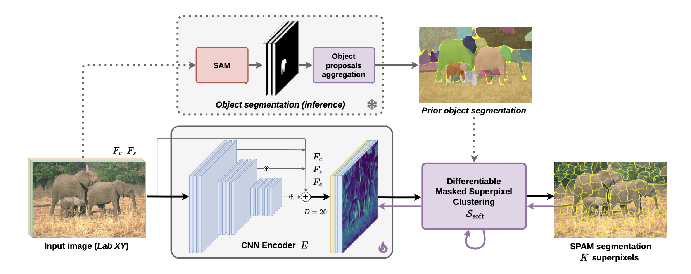

# Superpixel Anything: A general object-based framework for accurate yet regular superpixel segmentation

Julien Walther - Rémi Giraud - Michaël Clément

Affiliation(s)

[📄 Main Paper](assets/main_paper.pdf) · [📄 Supp Mat](assets/supp_mat.pdf) · [📦 Code](https://github.com/waldo-j/spam)



## Abstract

Superpixels are widely used in computer vision to simplify image representation and reduce computational complexity. While traditional methods rely on low-level features, deep learning-based approaches leverage high-level features but also tend to sacrifice regularity of superpixels to capture complex objects, leading to accurate but less interpretable segmentations. In this work, we introduce SPAM (SuperPixel Anything Model), a versatile framework for segmenting images into accurate yet regular superpixels. We train a model to extract image features for superpixel generation, and at inference, we leverage a large-scale pre-trained model for semantic-agnostic segmentation to ensure that superpixels align with object masks. SPAM can handle any prior high-level segmentation, resolving uncertainty regions, and is able to interactively focus on specific objects. Comprehensive experiments demonstrate that SPAM qualitatively and quantitatively outperforms state-of-the-art methods on segmentation tasks, making it a valuable and robust tool for various applications Short abstract of the paper. Explain the problem, method, and results in a few sentences.

## Highlights

- Point 1 (result or method)
- Point 2 (result or method)
- Point 3 (result or method)

## BibTeX

```bibtex
@article{yourkey2025,
  title={Awesome Paper Title},
  author={Author One and Author Two and Author Three},
  journal={Venue / arXiv},
  year={2025},
  doi={10.xxx/xxxxx}
}
```
